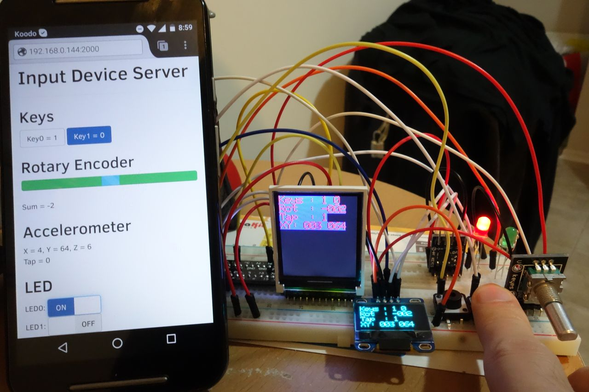

# Input Device Server on Raspberry Pi
* The entire project consists of C++ library and Web server running on Python
* C++ library gathers the following input device information connected to Raspberry Pi
	* Key (GPIO)
	* Rotary Encoder (GPIO)
	* Accelerometer(ADXL345) (I2C)

* C++ library displays the input device status in the following displays connected to Raspberry Pi
	* OLED SSD1306 (I2C)
	* LCD ST7735R(SPI)

* Web application (Python) provides WebAPI using shared library which offers the above functions

* Html/JavaScript call WebAPI (ajax) and display the input device status in client web browser




### Whole picture


### Whole picture in details


## C++ (User land) side
### Environment
* NetBeans C/C++ Bundle

### Libraries required
* wiringPi
```
pi$> mkdir libraries
pi$> cd libraries
pi$> git clone git://git.drogon.net/wiringPi
pi$> cd wiringPi
pi$> ./build
pi$> cd ../
```

* Boost.Python
```
pi$> sudo apt install libboost-all-dev
```


### Build on Host PC
* Refer to <https://github.com/take-iwiw/RaspberryPiCrossCompileSetup>
* You can create C++ application (start from main), but you cannot create shared library "InputDeviceServer.so" file on Host PC. (It might be possible if you install Boost.Python for ARM)

### Build on Raspberry Pi
* Type the following command on Raspberry Pi after you upload all the source code. It generate a shared library("so")
```
g++ -I/usr/include/python2.7  -DPYTHON_WRAPPER -fPIC -shared -o InputDeviceServer.so Application.cpp ./DriverGPIO/gpio.c ./DriverI2C/i2c.c ./DriverLcdST7735R/DriverLcdST7735R.cpp ./DriverLcdST7735R/DriverLcdST7735RText.cpp ./DriverOledSSD1306/DriverOledSSD1306.cpp ./DriverOledSSD1306/DriverOledSSD1306Text.cpp ./DriverSpi/spi.c ./InputDevices/InputDevices.cpp OutputTest.cpp PythonWrapper.cpp ./font/font.c -lboost_python -lwiringPi -lpthread
```

### Memo I2C setup
* Enable I2C (and SPI)
	* $PI$ > sudo raspi-config
	* 9 Advanced Options
		* A7 I2C
		* A6 SPI

* Install necessary tools
	* $PI$ > sudo apt-get install i2c-tools

* Try I2C from console
	* $PI$ > i2cdetect -y 1
	* $PI$ > i2cget -y 1 0x53 0x00 b


## Web (Python) side
### How to run
sudo index.py &

### Python Libraries needed
* pip install flask

### HTML Libraries used
* already saved in static directory
	* jQuery
	* bootstrap
	* bootstrap-switch
	* AngularJS

## keep it running
```
$PI$ > sudo chmod +x  /etc/rc.local
$PI$ > sudo nano /etc/rc.local
```
```
# ... other start up scripts
# Start Input Device Servr
python /home/pi/dev/InputDeviceServerWeb/index.py &

exit 0
```
* note: path must be absolute path (neither ../ nor ~/)


## Portmap
```
## IO
GPIO00 = N/A
GPIO01 = N/A
GPIO02 = I2C_SDA
GPIO03 = I2C_SCL
GPIO04 = 
GPIO05 = 
GPIO06 = 
GPIO07 = SPI_CE1
GPIO08 = SPI_CE0
GPIO09 = SPI_MISO
GPIO10 = SPI_MOSI
GPIO11 = SPI_SCLK
GPIO12 = 
GPIO13 = 
GPIO14 = UART_TXD
GPIO15 = UART_RXD
GPIO16 = LcdST7735R_RS
GPIO17 = INPUT_KEY0
GPIO18 = 
GPIO19 = 
GPIO20 = INPUT_RotaryEncoder_B
GPIO21 = INPUT_RotaryEncoder_A
GPIO22 = LED_0
GPIO23 = LED_1
GPIO24 = 
GPIO25 = N/A
GPIO26 = 
GPIO27 = INPUT_KEY1
GPIO28 = N/A
GPIO29 = N/A

## Function
USART = System Console
SPI0.0 = LcdST7735R
SPI0.1 = 
I2C = Accelerometer (ADXL345), OLED_SSD1306
```


